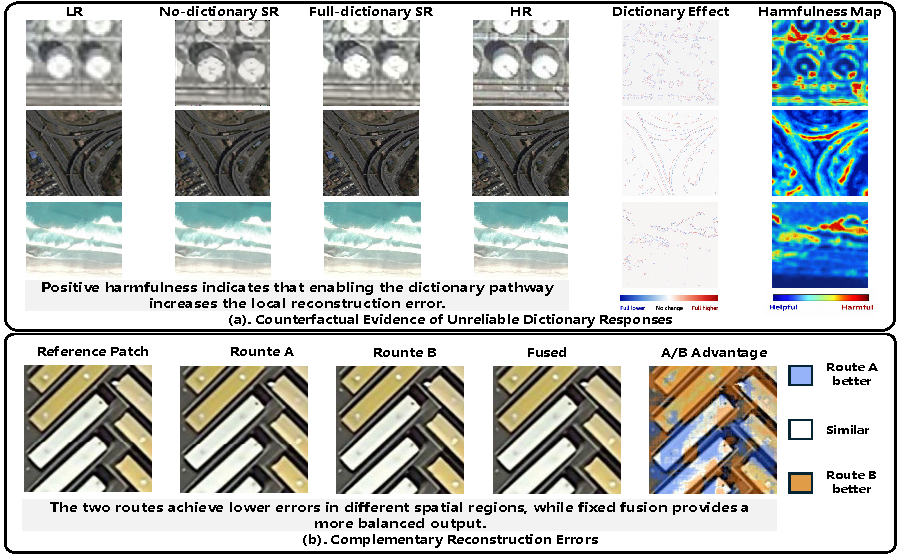
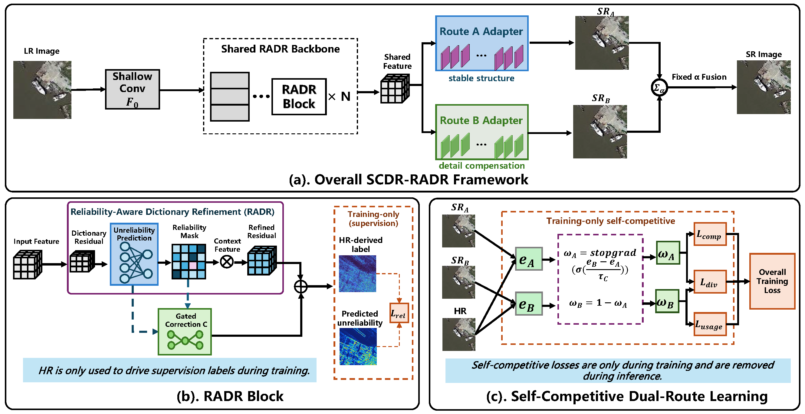
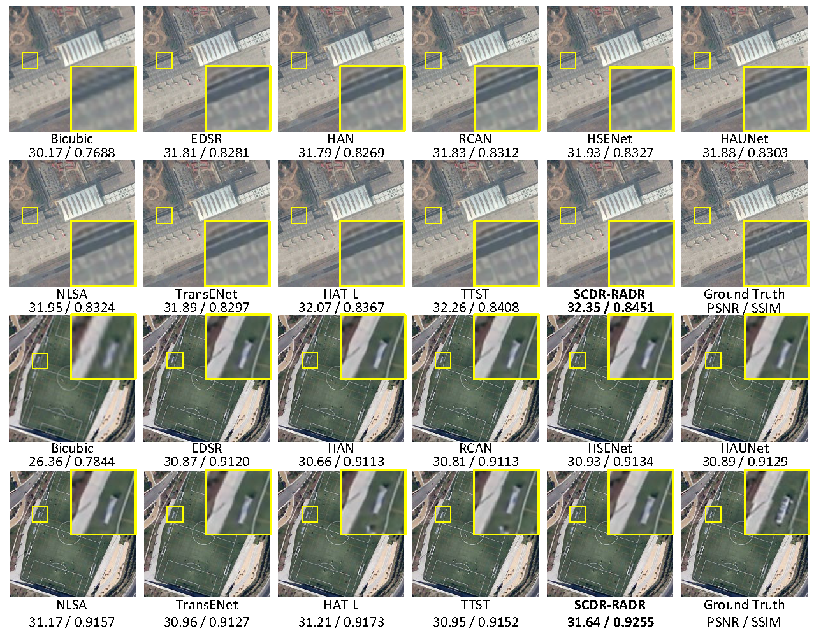
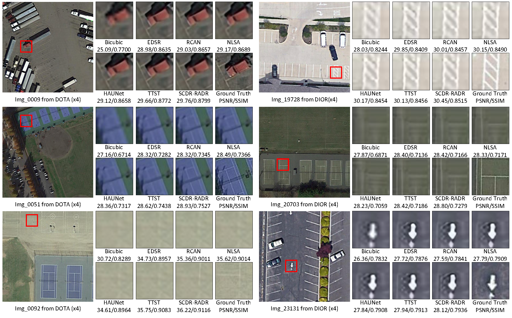

# Reliability-Aware and Self-Competitive Dictionary Refinement for Remote Sensing Image Super-Resolution

<p align="center">
  <b>Official PyTorch implementation of SCDR-RADR for remote sensing image super-resolution.</b>
</p>


<p align="center">
  <a href="#-news">News</a> |
  <a href="#-motivation">Motivation</a> |
  <a href="#-results">Results</a> |
  <a href="#-data-preparation">Data</a> |
  <a href="#-testing">Testing</a> |
  <a href="#-citation">Citation</a>
</p>

---

## 🚀 News

* **2026.08.15** — Initial release of **SCDR-RADR**.
* **2026.08.15** — Evaluation code for **4× remote sensing image super-resolution** has been released.

---

## 🔍 Motivation

Dictionary-enhanced super-resolution can provide useful high-frequency information, but the retrieved dictionary responses are not uniformly reliable. In ambiguous remote sensing regions, a dictionary response may increase local reconstruction error instead of reducing it.

<p align="center">
  
</p>

<p align="center">
  <em>Motivation of SCDR-RADR: counterfactual evidence of unreliable dictionary responses and complementary reconstruction errors.</em>
</p>

---

## 🧠 Framework

SCDR-RADR combines counterfactual reliability supervision, reliability-aware dictionary refinement, and complementary dual-route reconstruction.

<p align="center">
  
</p>

<p align="center">
  <em>Overall framework of SCDR-RADR.</em>
</p>

---

## 📊 Results

### Quantitative Comparison on 4× RSISR

All learning-based methods are trained using the same AID training data and evaluated under the same protocol. PSNR/SSIM are computed on the luminance channel.

| Method        |     Params |       FLOPs |       AID900       |        DOTA        |      DIOR1000      |       Average      |
| :------------ | ---------: | ----------: | :----------------: | :----------------: | :----------------: | :----------------: |
| Bicubic       |          – |           – |   28.89 / 0.7377   |   31.22 / 0.7958   |   30.83 / 0.8263   |   30.31 / 0.7866   |
| EDSR          |     43.09M |     323.34G |   30.66 / 0.8048   |   33.83 / 0.8632   |   31.00 / 0.8255   |   31.83 / 0.8312   |
| RCAN          |     15.59M |     261.01G |   30.66 / 0.8073   |   33.84 / 0.8654   |   31.02 / 0.8264   |   31.84 / 0.8330   |
| HAN           |     16.07M |     268.89G |   30.74 / 0.8068   |   33.96 / 0.8648   |   31.03 / 0.8259   |   31.91 / 0.8325   |
| HAUNet        |      9.06M |      85.61G |   30.72 / 0.8058   |   33.98 / 0.8646   |   31.13 / 0.8278   |   31.94 / 0.8327   |
| HSENet        |     21.70M |     306.31G |   30.78 / 0.8078   |   34.08 / 0.8668   |   31.09 / 0.8269   |   31.98 / 0.8338   |
| NLSA          |     44.15M |     340.79G |   30.80 / 0.8083   |   34.09 / 0.8668   |   31.11 / 0.8275   |   32.00 / 0.8342   |
| TransENet     |     37.46M |      87.85G |   30.61 / 0.8059   |   33.84 / 0.8650   |   31.12 / 0.8293   |   31.86 / 0.8334   |
| HAT-L         |     40.32M |     672.15G |   30.87 / 0.8102   |   34.18 / 0.8685   |   31.13 / 0.8277   |   32.06 / 0.8353   |
| TTST          |     18.94M |     317.68G |   31.10 / 0.8175   |   34.38 / 0.8722   |   31.09 / 0.8265   |   32.16 / 0.8384   |
| **SCDR-RADR** | **17.50M** | **205.61G** | **31.12 / 0.8179** | **34.56 / 0.8751** | **31.16 / 0.8278** | **32.28 / 0.8402** |

### Visual Comparisons

<p align="center">
  
</p>

<p align="center">
  <em>Visual comparison on representative AID900 scenes.</em>
</p>

<br>

<p align="center">
  
</p>

<p align="center">
  <em>Visual comparison on representative DOTA and DIOR1000 scenes.</em>
</p>

---

## 🎁 Data Preparation

We evaluate **4× RSISR** on three benchmarks:

* **AID900:** 900 images sampled from the AID validation set.
* **DOTA:** the DOTA evaluation set used in the reported experiments.
* **DIOR1000:** 1000 images sampled from the DIOR validation set.

All learning-based models are trained only on the **AID training set**.

LR images are generated using bicubic downsampling following the data-preparation protocol used in TTST. Evaluation uses PSNR and SSIM on the luminance channel, with four boundary pixels excluded for 4× SR.

> Dataset download links will be provided soon.

The datasets should be organized as follows:

```text
datasets/
├── AID/
│   ├── HR/
│   └── LR/
├── DOTA/
│   ├── HR/
│   └── LR/
└── DIOR/
    ├── HR/
    └── LR/
```

---

## ⚡ Testing

The pre-trained checkpoint will be released soon.

Once released, place the pre-trained checkpoint in the model directory specified by the evaluation configuration.

Then run the evaluation script:

```bash
python eval_4x_y.py --config <test_config>
```

---

## 📚 Citation

If you find this work useful for your research, please consider citing it.

```bibtex
@misc{zhang2026scdrradr,
  title  = {Reliability-Aware and Self-Competitive Dictionary Refinement for Remote Sensing Image Super-Resolution},
  author = {Fengyuan Zhang and Xueying Wang and Xinpeng Zhao and Zhengyu Liang and Haoufei Liu and Jungang Yang and Yingqian Wang},
  year   = {2026}
}
```

---

## 📧 Contact

For questions about the code or experiments, please open a GitHub issue or contact:

* Fengyuan Zhang: `zhangfengyuan24a@nudt.edu.cn`
